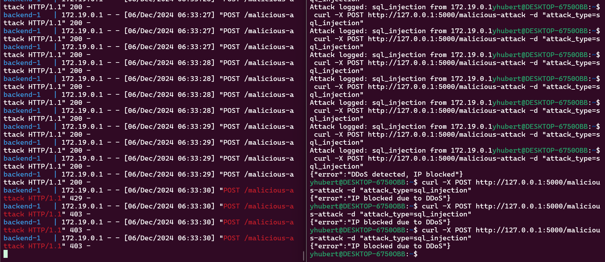
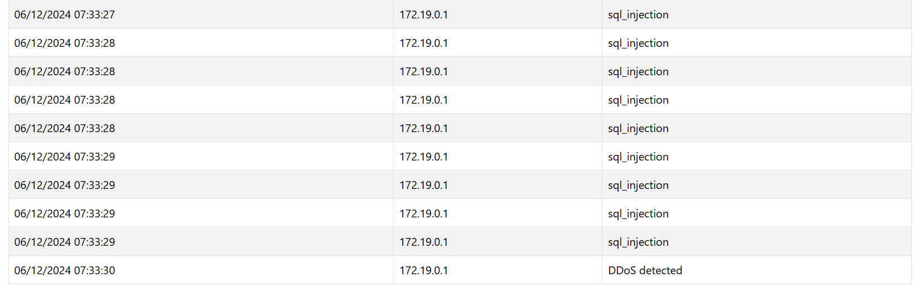

# Honeypot Project

Ce projet est un système Honeypot conçu pour détecter, surveiller et répondre à des attaques potentielles. Il est composé de trois services principaux :
- **Frontend** : Une interface utilisateur pour visualiser les logs des attaques.
- **Backend** : Une API pour traiter les données et gérer la communication avec la base de données.
- **Database** : Un serveur PostgreSQL pour stocker les logs des attaques.

Ce document vous guidera à travers les étapes pour lancer et utiliser l'application.

---

## Prérequis
Assurez-vous d'avoir les outils suivants installés sur votre machine :
- [Docker](https://www.docker.com/)
- [Docker Compose](https://docs.docker.com/compose/install/)

---

## Structure du projet
Le projet est organisé comme suit :
```
honeypot-project/
├── frontend/       # Code source de l'interface utilisateur
├── backend/        # Code source de l'API
├── docker-compose.yml  # Fichier de configuration Docker Compose
```

---

## Installation
### 1. Cloner le dépôt
Commencez par cloner le dépôt sur votre machine locale :
```bash
git clone <url-du-repo>
cd honeypot-project
```

### 2. Construire et démarrer les services
Utilisez Docker Compose pour construire et lancer tous les services :
```bash
docker-compose up --build
```
Cette commande :
- Télécharge les images nécessaires (si elles ne sont pas déjà présentes).
- Construit les conteneurs pour le frontend et le backend.
- Lance les trois services (frontend, backend, database).

### 3. Vérifier les services
- Frontend : Disponible sur [http://localhost:3001](http://localhost:3001)
- Backend : Disponible sur [http://localhost:5000](http://localhost:5000)
- Database : Accessible uniquement via le backend

---

## Utilisation
### Accéder à l'interface utilisateur
1. Ouvrez votre navigateur à l'adresse suivante : [http://localhost:3001](http://localhost:3001).
2. Connexion admin via username : admin, password : password
2. Consultez le tableau de bord pour voir les logs des attaques.
3. Les informations affichées incluent :
   - **Horodatage**
   - **Adresse IP source**
   - **Type d'attaque**

### Simuler une attaque
Pour tester le système, vous pouvez :
1. Lancer des requêtes malveillantes simulées vers le backend à l'aide d'outils comme cURL ou Postman.
- Exemple : curl -X POST http://127.0.0.1:5000/malicious-attack -d "attack_type=sql_injection"
2. Les attaques seront détectées, enregistrées dans la base de données et affichées dans le frontend.

Autre exemple lancer plusieurs requetes POST pendant 30 secondes, votre IP sera bloquée



---

## Gestion des services
### Arrêter les services
Pour arrêter tous les conteneurs :
```bash
docker-compose down
```

### Recréer les conteneurs
Si vous apportez des modifications au code source, vous devrez reconstruire les images :
```bash
docker-compose up --build
```

---

## Dépannage
### Problèmes fréquents
1. **Port déjà utilisé** :
   - Modifiez les ports exposés dans `docker-compose.yml`.
2. **Erreur de connexion à la base de données** :
   - Vérifiez les logs du conteneur PostgreSQL :
     ```bash
     docker logs honeypot-project_database_1
     ```

### Consulter les logs des conteneurs
Pour afficher les logs d'un conteneur spécifique :
```bash
docker logs <nom_du_conteneur>
```

---

## Améliorations futures
- Ajouter des graphiques pour une meilleure visualisation des données.
- Intégrer des notifications en temps réel.
- Améliorer la détection des types d'attaques.

---

## Contribution
Si vous souhaitez contribuer à ce projet :
1. Forkez le dépôt.
2. Créez une branche pour vos modifications :
   ```bash
   git checkout -b nouvelle-fonctionnalite
   ```
3. Envoyez une pull request.

---

## Auteurs
- **Ledyxoo** : Développement Backend et Configuration de la Base de Données.
- **noctune153** : Développement Frontend et Orchestration Docker.

---
